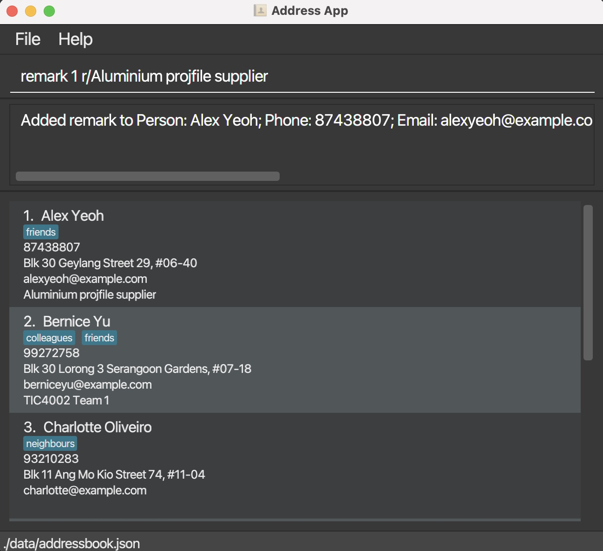

* The project simulates an ongoing software project for a desktop application (called _Contacts Address Book_) used for managing contact details.
  * Contacts Address Book (CAB) is a desktop app that manages various contacts with added functionality.
  * Users can input via a command line interface and access features that help with contacts management.

* For the detailed documentation of this project, see the **[Contacts Address Book Product Website](https://ay2122s2-tic4002-f18-1.github.io/tp2/)**.
