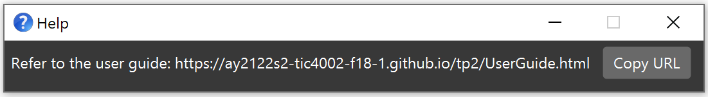

Contacts Address Book (CAB) is a **desktop app that manages various contacts with added functionality.**
Users can input via a command line interface and access features that help with contacts management.
* Table of Contents
{:toc}

--------------------------------------------------------------------------------------------------------------------

## Quick start

1. Ensure you have Java `11` or above installed in your Computer.

2. Download the latest `addressbook.jar` from [here](https://github.com/AY2122S2-TIC4002-F18-1/tp2/releases).

3. Copy the file to the folder you want to use as the _home folder_ for your Contacts Address Book.

4. Double-click the file to start the app. The GUI similar to the below should appear in a few seconds. Note how the app contains some sample data. 
   

5. Type the command in the command box and press Enter to execute it. e.g. typing **`help`** and pressing Enter will open the help window. 
   Some example commands you can try:

   * **`help`** : Shows the message explaining how to use the system.

   * **`add`**`n/John Doe p/98765432 e/johnd@example.com a/John street, block 123, #01-01` : Adds a contact named `John Doe` to the Address Book.

   * **`edit`**`1 n/John Doe p/98765432 e/johnd@example.com a/John street, block 123, #01-01` : Edits details of the 1st contact in the Address Book.

   * **`delete`**`3` : Deletes the 3rd contact shown in the current list.

   * **`clear`** : Deletes all contacts.

   * **`remark`** `INDEX r/DESCRIPTION` : Add remark to a contact.

   * **`create`** `g/GROUPNAME` : Creates a new group to the address book.

   * **`assign`** `n/PERSONNAME g/GROUPNAME`: Assign contact to a group.

   * **`unassign`** `1`: Remove existing group from the 1st contact. (coming soon)

   * **`rename`** `GROUP_INDEX g/GROUP_NAME`: Renaming the existing group at the index to another name.

   * **`deleteg`** `1` : Delete the 1st group show in the current list.
   
   * **`list`** : Lists all contacts.

   * **`listgn`** : Lists all groups.

   * **`listpfg`** `g/GROUPNAME` : Lists all contacts from a specific group.

   * **`listfav`** : List all contacts that are marked with favourite

   * **`find`** `KEYWORD [MORE_KEYWORDS]`: Finds contacts that contain the keywords

   * **`exit`** : Exits the app.

1. Refer to the [Features](#features) below for details of each command.

--------------------------------------------------------------------------------------------------------------------

## Features

**:information_source: Notes about the command format:** 

* Words in `UPPER_CASE` are the parameters to be supplied by the user. 
  e.g. in `add n/NAME`, `NAME` is a parameter which can be used as `add n/John Doe`.

* Items in square brackets are optional. 
  e.g `n/NAME [t/TAG]` can be used as `n/John Doe t/friend` or as `n/John Doe`.

* Items with `…`​ after them can be used multiple times including zero times. 
  e.g. `[t/TAG]…​` can be used as ` ` (i.e. 0 times), `t/friend`, `t/friend t/family` etc.

* Parameters can be in any order. 
  e.g. if the command specifies `n/NAME p/PHONE_NUMBER`, `p/PHONE_NUMBER n/NAME` is also acceptable.

* If a parameter is expected only once in the command but you specified it multiple times, only the last occurrence of the parameter will be taken. 
  e.g. if you specify `p/12341234 p/56785678`, only `p/56785678` will be taken.

* Extraneous parameters for commands that do not take in parameters (such as `help`, `list`, `exit` and `clear`) will be ignored. 
  e.g. if the command specifies `help 123`, it will be interpreted as `help`.

* Commands keyword and prefix are case-sensitive. e.g. `help` and `Help` are treated as different command.

### Viewing help : `help`

Shows a message explaning how to access the help page.

Format: `help`

### Contacts

### Adding a contact: `add`

Adds a new contact to the address book.

Format: `add n/NAME p/PHONE_NUMBER e/EMAIL a/ADDRESS [t/TAG]…​`

:bulb: **Tip:**
A contact can have any number of tags (including 0)

Examples:
* `add n/John Doe p/98765432 e/johnd@example.com a/John street, block 123, #01-01`
* `add n/Betsy Crowe t/friend e/betsycrowe@example.com a/Newgate Prison p/1234567 t/criminal`

### Editing a contact : `edit`

Edits an existing contact in the address book.

Format: `edit INDEX [n/NAME] [p/PHONE] [e/EMAIL] [a/ADDRESS] [t/TAG]…​`

* Edits the contact at the specified `INDEX`. The index refers to the index number shown in the displayed contact list.
* Index **must be a positive integer** 1, 2, 3, …​
* Index **cannot be greater than the number of contacts** e.g. if there are 7 contacts, index cannot be of a value that is greater than 7
* At least one of the optional fields must be provided.
* Existing values will be updated to the input values.
* When editing tags, the existing tags will be overwritten with the new tags i.e. editing of tags does not append to existing ones.
* Users can remove all of a contact's tag by typing `t/` without
  specifying any tags after it.

Examples:
*  `edit 1 p/91234567 e/johndoe@example.com` Edits the phone number and email address of the 1st person to be `91234567` and `johndoe@example.com` respectively.
*  `edit 2 n/Betsy Crower t/` Edits the name of the 2nd person to be `Betsy Crower` and clears all existing tags.

### Deleting a contact : `delete`

Deletes a specific contact from the address book.

Format: `delete INDEX`

* Deletes the contact at the specified `INDEX`.
* Index refers to the index number shown in the displayed person list.
* Index **must be a positive integer** 1, 2, 3, …​

Examples:
* `list` followed by `delete 2` deletes the 2nd person in the address book.
* `find Betsy` followed by `delete 1` deletes the 1st person in the results of the `find` command.

### Deleting all contact(s) : `clear`

Deletes all contact(s) from the address book

Format: `clear`

### Adding/Updating/Removing remarks: `remark`

Adds a remark to an existing contact. If contact has an existing remark, update the remark instead. 

Format: `remark <INDEX> r/<DESCRIPTION>`

If `<DESCRIPTION>` is left blank, it will be treated as if the user does not want a remark and will remove the existing 
remark instead. Alternative, if you did not put `r/` (e.g. `remark <INDEX>`), the remark will also be removed,

Examples:
* `remark 1 r/standard steel supplier` Add a remark to the 1st contact.
* `remark 1 r/` Remove the remark that was added to the 1st contact.
* `remark 1` Also remove the existing remark of the 1st contact.

### Favouriting/Unfavouriting a contact: `favourite` / `fav`

Add Favourite to an existing contact or remove favourite from an existing favourite contact.

Format: `favourite <INDEX>` OR `fav <INDEX>`

Examples:
* `fav 1` Favourites the first contact if it was not a favourite previously. Else, unfavourite the first contact instead.

### Groups

### Creating a group: `create`

Create a new group in the address book.

Format: `create g/<GROUP NAME>`

Examples:
* `create g/SUPPLIERS`
* `create g/CUSTOMERS`

### Assigning a contact to a group: `assign`

Assign a contact to an existing group in the address book.

Format: `assign n/<CONTACT NAME> g/<GROUP NAME>`

:bulb: **Tip:**
Remember that the contact name is case sensitive.

   

Examples:
* `assign n/John g/SUPPLIERS

### Renaming a group: `rename` 

Rename an existing group to another name.

Format: `rename <INDEX> g/<GROUP NAME>`
* Index **must be a positive integer** 1, 2, 3, …​
* Index **cannot be greater than the number of groups** e.g. if there are 7 groups, index cannot be of a value that is greater than 7

Examples:
* `rename 1 g/SUPPLIERS` Renames the first group into SUPPLIERS.

### Deleting a group: `deleteg`

Delete an existing group in the address book.

Format: `deleteg <INDEX>`
* Index **must be a positive integer** 1, 2, 3, …​
* Index **cannot be greater than the number of groups** e.g. if there are 7 groups, index cannot be of a value that is greater than 7

Examples:
* `deleteg 1` Deletes the first group in address book.

### List

### Listing all contact(s) : `list`

Display a list of all contacts in the address book.

Format: `list`

### List all group(s): `listgn` / `listgrp`

Display a list of all groups in address book.

Format: `listgn`

### List all contact(s) in a specific group: `listpfg`

Display a list of contact from a specific group in address book.

Format: `listpfg g/GROUPNAME`

Examples:
* `listpfg g/CUSTOMERS`

### Listing all favourite contacts : `listfav`

Displays a list of contacts that are marked as favourite in the address book.

Format: `listfav`

### Find

### Finding contact(s) by name: `find`

Finds contact(s) whose contact details contain any of the given keywords.

Format: `find KEYWORD [MORE_KEYWORDS]`

* The search is case-insensitive. e.g `hans` will match `Hans`
* The order of the keywords does not matter. e.g. `Hans Bo` will match `Bo Hans`
* Only Contact Details are searched. Contact Details include name, address, phone number and email only.
* Full words and partial words will be matched. e.g. 
`Han` will match `Hans` for names,
`123` will match `21234` for phone numbers,
`yish` will match `yishun` for addresses,
`tes` will match `test@email.com` for emails.

* Persons matching at least one keyword will be returned (i.e. `OR` search).
  e.g. `Hans Bo` will return `Hans Gruber`, `Bo Yang`

Examples:
* `find John` returns `john` and `John Doe`
* `find alex david` returns `Alex Yeoh`, `David Li` 
  

### Finding contact(s) by remark: `findr` / `findremark`

Finds contact(s) whose remark contain any of the given keywords.

Format: `findr KEYWORD [MORE_KEYWORDS]` OR `findremark KEYWORD [MORE_KEYWORDS]`

* The search is case-insensitive.
* The order of the keywords does not matter. 
* Full words and partial words will be matched.
* Persons matching at least one keyword will be returned (i.e. `OR` search).

Examples:
* `findr swim` returns all contacts with remarks that contains "swim"

### Finding contact(s) by group name: `findg` / `findgroup`

Finds contact(s) who are assigned to group that contains any of the given keywords.

Format: `findg KEYWORD [MORE_KEYWORDS]` OR `findgroup KEYWORD [MORE_KEYWORDS]`

* The search is case-insensitive.
* The order of the keywords does not matter.
* Full words and partial words will be matched.
* Persons matching at least one keyword will be returned (i.e. `OR` search).

Examples:
* `findg NUS` returns all contacts assigned to group that contains "NUS"

### Exiting the program : `exit`/ `bye` / `quit` / `/q`

Exits the program.

Format: `exit` OR `bye` OR `quit` OR `/q`

### Saving the data

AddressBook data are saved in the hard disk automatically after any command that changes the data. There is no need to save manually.

### Editing the data file

AddressBook data are saved as a JSON file `[JAR file location]/data/addressbook.json`. Advanced users are welcome to update data directly by editing that data file.

:exclamation: **Caution:**
If your changes to the data file makes its format invalid, AddressBook will discard all data and start with an empty data file at the next run.

### Archiving data files `[coming in v2.0]`

_Details coming soon ..._

--------------------------------------------------------------------------------------------------------------------

## FAQ

**Q**: How do I transfer my data to another Computer? 
**A**: Install the app in the other computer and overwrite the empty data file it creates with the file that contains the data of your previous AddressBook home folder.

--------------------------------------------------------------------------------------------------------------------

## Command summary

Action | Format, Examples
--------|------------------
**Help**| `help`
**Add Contact** | `add n/NAME p/PHONE_NUMBER e/EMAIL a/ADDRESS [t/TAG]…​`   e.g., `add n/James Ho p/22224444 e/jamesho@example.com a/123, Clementi Rd, 1234665 t/friend t/colleague`
**Edit Contact** | `edit INDEX [n/NAME] [p/PHONE_NUMBER] [e/EMAIL] [a/ADDRESS] [t/TAG]…​`  e.g.,`edit 2 n/James Lee e/jameslee@example.com`
**Delete Contact** | `delete INDEX`  e.g., `delete 3`
**Delete All Contact** | `clear`
**Add Remarks** | `remark INDEX r/[REMARK]`   e.g., `remark 1 r/Send notes`
**Update Remarks** | `remark INDEX r/[REMARK]`   e.g., `remark 1 r/Send notes`
**Delete Remarks** | `remark INDEX`   e.g., `remark 1`
**Favourite Contact** | `favourite INDEX` OR `fav INDEX`   e.g., `fav 1`
**Un-Favourite Contact** | `favourite INDEX` OR `fav INDEX`  e.g., `fav 1`
**Create Group** | `create g/GROUPNAME`   e.g., `create g/NUS TIC4002`
**Assign Group to Contact** | `assign n/PERSONNAME g/GROUPNAME`   e.g., `assign n/John Doe g/NUS TIC4002`
**Rename Group** |`rename INDEX g/GROUPNAME`   e.g., `rename 1 g/NUS TIC4002`
**Delete Group** | `deleteg INDEX`   e.g., `deleteg 1`
**List All Contact(s)** | `list`
**List All Group(s)** | `listgn`
**List All Contact in Group** | `listpfg g/GROUPNAME`   e.g., `listpfg g/NUS TIC4002`
**List All Favourite Contact** | `listfav`
**Find By Name** | `find KEYWORD [MORE_KEYWORDS]`  e.g., `find James Jake`
**Find By Remarks** | `findr KEYWORD [MORE_KEYWORDS]` OR `findremark KEYWORD [MORE_KEYWORDS]`   e.g., `findr notes`
**Find By Group Name** | `findg KEYWORD [MORE_KEYWORDS]` OR `findgroup KEYWORD [MORE_KEYWORDS]`   e.g., `findg NUS`
**Exiting the program** | `exit` OR `bye` OR `quit` OR `/q`

